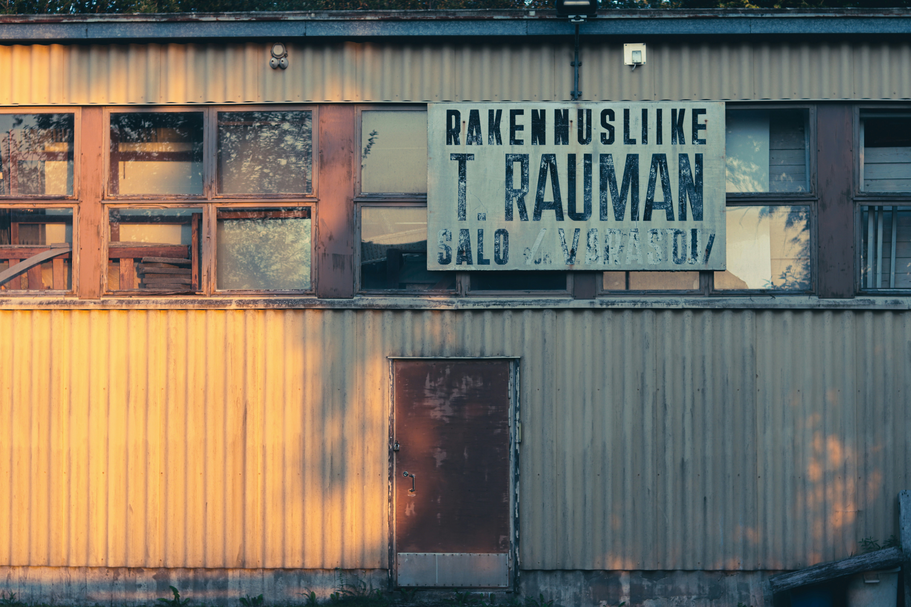
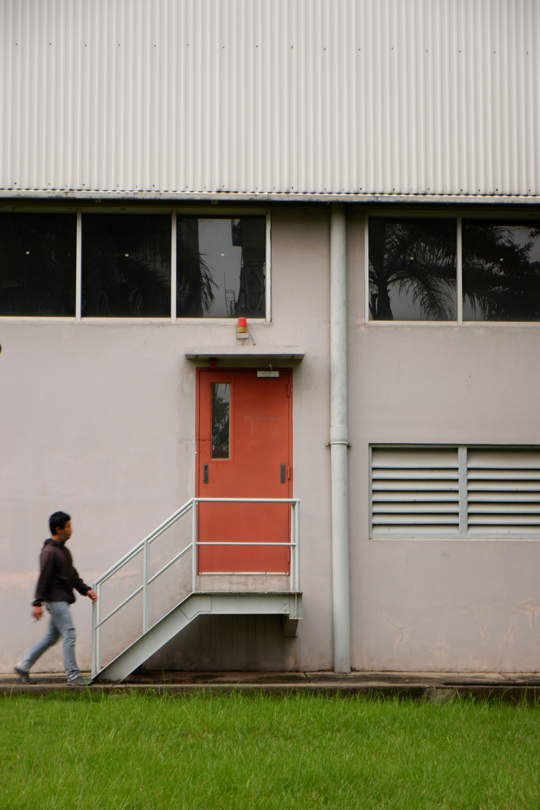
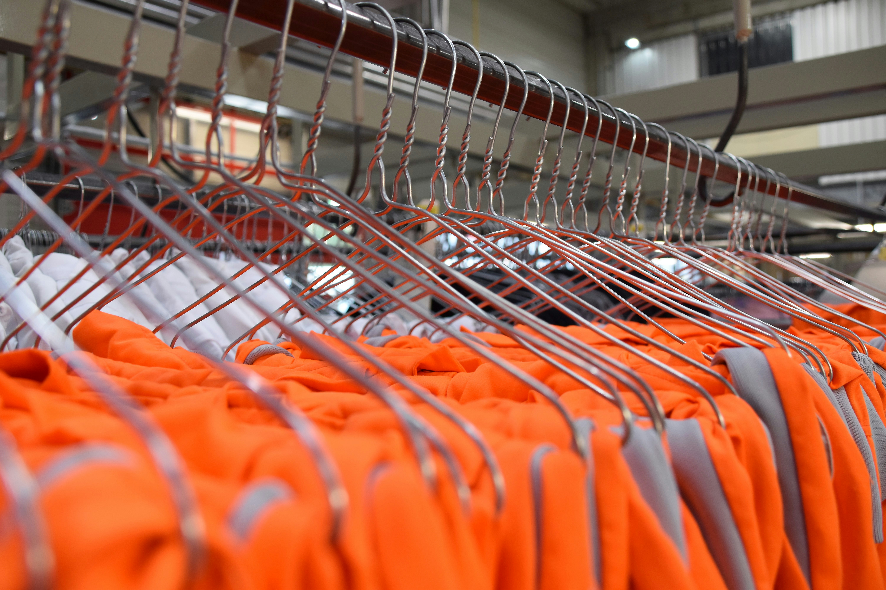
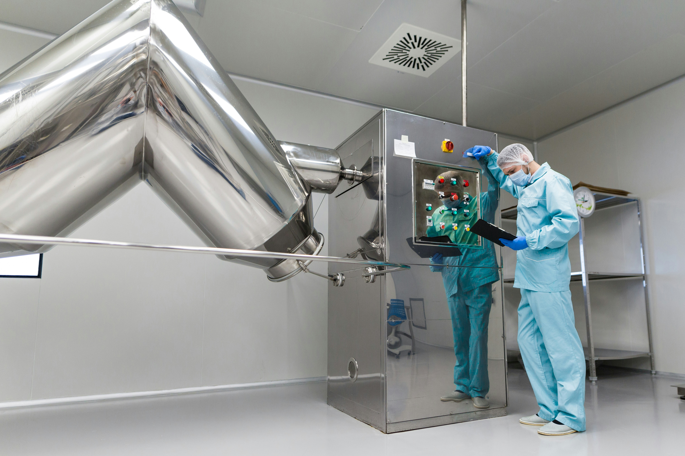

# Nordic Circular Polyester for FabricAir

> **Why This Research?** EU Extended Producer Responsibility (EPR) requires textile recycling by 2028. FabricAir needs 100% polyester or polyamide sources for circular ventilation textiles. This platform maps Nordic partners who can supply that material.

---

## The Opportunity

### Nordic Recycling Capacity: 56,000-62,000 t/yr
**Total infrastructure capacity by 2029**

> **⚠️ Important Distinction:**
> - **Infrastructure capacity:** 56,000-62,000 t/yr (what recyclers CAN process)
> - **FabricAir-compatible material:** 300-700 t/yr (100% white PET/polyamide only)
>
> The 60x difference is because most Nordic workwear uses 65/35 poly-cotton blends, which are NOT compatible with FabricAir's 100% polyester/polyamide requirement. Target cleanroom/pharma sectors for pure materials.

---

## Your Three Partners

| | Finland | Sweden | Norway |
|:--|:--:|:--:|:--:|
| **Partner** | **Rester** | **Rewin** | **NTG** |
| **Capacity** | 6k t/yr (current) → 12k (scaling) | 20k t/yr | 30k t/yr |
| **Status** | **NOW** | 2027 | **~2027** |
| **Technology** | Mechanical | Chemical | Defibration |
| **Risk** | Lindström shareholder | Pre-launch | Distance |

---

## Take Action Now

### Contact Rester (Finland) — Operational Today

| | |
|:--|:--|
| **Contact** | **Jukka Pesola (CEO since Aug 2025)** |
| **Email** | [hello@rester.fi](mailto:hello@rester.fi?subject=FabricAir%20Partnership%20Inquiry%20-%20Recycled%20Polyester&body=Dear%20Rester%20Team%2C%0A%0AI%20am%20reaching%20out%20from%20FabricAir%20regarding%20a%20potential%20partnership%20for%20recycled%20polyester%20supply.%0A%0AWe%20are%20seeking%3A%0A-%20100%25%20polyester%20(PET)%0A-%20White%20preferred%0A-%20~300%20g%2Fm%C2%B2%20weight%0A%0ACould%20we%20schedule%20a%20meeting%20to%20discuss%3F%0A%0ABest%20regards) |
| **Why** | Only operational Nordic recycler today |
| **Funding** | €4.9M secured Jan 2025 |
| **Strategy** | "High potential industrial applications" — good FabricAir alignment |
| **Risk** | Lindström is 2nd largest shareholder (NO exclusive access confirmed) |

**[Email Rester Now](mailto:hello@rester.fi?subject=FabricAir%20Partnership%20Inquiry%20-%20Recycled%20Polyester&body=Dear%20Rester%20Team%2C%0A%0AI%20am%20reaching%20out%20from%20FabricAir%20regarding%20a%20potential%20partnership%20for%20recycled%20polyester%20supply.%0A%0AWe%20are%20seeking%3A%0A-%20100%25%20polyester%20(PET)%0A-%20White%20preferred%0A-%20~300%20g%2Fm%C2%B2%20weight%0A%0ACould%20we%20schedule%20a%20meeting%20to%20discuss%3F%0A%0ABest%20regards)**

---

### Contact NTG (Norway) — Largest Future Capacity

| | |
|:--|:--|
| **Contact** | Bent Tatsuyama Mathisen (CEO) |
| **Email** | [btm@ntgas.no](mailto:btm@ntgas.no?subject=FabricAir%20Partnership%20Inquiry%20-%20Future%20Capacity&body=Dear%20Mr.%20Mathisen%2C%0A%0AI%20am%20reaching%20out%20from%20FabricAir%20regarding%20NTG%27s%20upcoming%20recycling%20capacity.%0A%0AWe%20are%20interested%20in%20discussing%3A%0A-%20Future%20supply%20agreement%20for%20recycled%20polyester%0A-%20Your%20defibration%20technology%20capabilities%0A-%20Timeline%20for%20commercial%20scale%20operations%0A%0ACould%20we%20arrange%20a%20call%3F%0A%0ABest%20regards) |
| **Why** | 30k t/yr by **~2027** — largest Nordic recycler |
| **Unique** | Can process poly-cotton blends |
| **Funding** | Innovation Norway NOK 30M+ (verified) |

**[Email NTG Now](mailto:btm@ntgas.no?subject=FabricAir%20Partnership%20Inquiry%20-%20Future%20Capacity&body=Dear%20Mr.%20Mathisen%2C%0A%0AI%20am%20reaching%20out%20from%20FabricAir%20regarding%20NTG%27s%20upcoming%20recycling%20capacity.%0A%0AWe%20are%20interested%20in%20discussing%3A%0A-%20Future%20supply%20agreement%20for%20recycled%20polyester%0A-%20Your%20defibration%20technology%20capabilities%0A-%20Timeline%20for%20commercial%20scale%20operations%0A%0ACould%20we%20arrange%20a%20call%3F%0A%0ABest%20regards)**

---

### Contact Rewin (Sweden) — Virgin-Quality Output

| | |
|:--|:--|
| **Contact** | Joel Arnoldsson |
| **Website** | [wargoninnovation.se](https://wargoninnovation.se) |
| **Why** | Chemical recycling produces virgin-quality polyester |
| **Timeline** | October 2027 launch |

---

## Critical Findings

### What We Discovered

- **Lindström is NOT compatible** — uses 65:35 poly-cotton blends
- **Volume estimate revised** — 5-10k t/yr → **350-1,000 t/yr** of accessible 100% white polyester
- **LSJH plant cancelled** — Rester is now Finland's ONLY recycler
- **LSJH outsourcing** — Sorting transferred to Turun Ekotori (Jan 1, 2026); downstream NOT locked to Rester
- **Rester update (Dec 2025)** — New CEO Jukka Pesola, €4.9M funding, industrial focus
- **Lindström risk clarified** — 2nd largest shareholder, **NO exclusive access confirmed**
- **SIPTex (Sweden) being sold** — Sysav divesting due to lack of outlet markets
- **Rewin progress** — Pilot permits secured, operations by end 2025
- **NTG/NTS progress** — R&D facility Jan 2024, sorting Aug 2024, **timeline accelerated to ~2027**
- **Best sources** — Cleanroom/pharma sector (Orion, AstraZeneca) for 100% white PET/polyamide

### Market Overview

| Metric | Finland | Sweden | Norway |
|--------|:-------:|:------:|:------:|
| Textile waste | 85,770 t/yr | 60-80k t/yr | ~100k t/yr |
| Separately collected (2023) | 1,783 t | N/A | N/A |
| Services market | €350-450M | €560M | €180-270M |
| Material recycling | <1% | <1% | <1% |
| EPR date | 2027-28 | Apr 2028 | TBD |

---

## Feedstock Aggregators

### Contact These Companies for Material Supply

| Organization | Contact | Email | Country |
|:-------------|:--------|:------|:-------:|
| **Touchpoint** | Noora Salonoja (CEO) | [noora.salonoja@touchpoint.fi](mailto:noora.salonoja@touchpoint.fi?subject=FabricAir%20Inquiry%20-%20Workwear%20Recycling&body=Dear%20Ms.%20Salonoja%2C%0A%0AI%20am%20contacting%20you%20from%20FabricAir%20regarding%20recycled%20polyester%20sourcing.%0A%0ABest%20regards) | Finland |
| **Puro** | Paavo Martikainen (CEO) | [paavo.martikainen@puro.fi](mailto:paavo.martikainen@puro.fi?subject=FabricAir%20Inquiry%20-%20Healthcare%20Textiles&body=Dear%20Mr.%20Martikainen%2C%0A%0AI%20am%20contacting%20you%20from%20FabricAir%20regarding%20healthcare%20textile%20end-of-life%20streams.%0A%0ABest%20regards) | Finland |
| **Nor Tekstil** | Thomas Karlsen | [thomas.karlsen@nortekstil.no](mailto:thomas.karlsen@nortekstil.no?subject=FabricAir%20Inquiry%20-%20Healthcare%20Textiles%20Norway&body=Dear%20Mr.%20Karlsen%2C%0A%0AI%20am%20contacting%20you%20from%20FabricAir%20regarding%20textile%20recycling%20opportunities.%0A%0ABest%20regards) | Norway |
| **Elis Sweden** | Patrik Nyholm | [patrik.nyholm@elis.com](mailto:patrik.nyholm@elis.com?subject=FabricAir%20Inquiry%20-%20Cleanroom%20Textiles&body=Dear%20Mr.%20Nyholm%2C%0A%0AI%20am%20contacting%20you%20from%20FabricAir%20regarding%20cleanroom%20textile%20recycling.%0A%0ABest%20regards) | Sweden |
| **Elis Cleanroom** | Global contact | [cleanroom@elis.com](mailto:cleanroom@elis.com?subject=FabricAir%20Inquiry%20-%20Nordic%20Cleanroom%20Textiles&body=Dear%20Elis%20Cleanroom%20Team%2C%0A%0AI%20am%20contacting%20you%20from%20FabricAir%20regarding%20end-of-life%20cleanroom%20textiles%20across%20Nordics.%0A%0ABest%20regards) | Nordic |

**Note:** ~~Lindström~~ — EXCLUDED (uses 65:35 poly-cotton blends, NOT compatible with FabricAir)

---

## Best Sources for 100% White Polyester

| Rank | Sector | Why Best | Key Players |
|:----:|:-------|:---------|:------------|
| 1 | **Cleanroom/Pharma** | >90% white, 99% PET + 1% carbon | Orion, AstraZeneca, Okmetic |
| 2 | Food Processing | 70-80% white, mixed blends | Valio, Fazer, Atria |
| 3 | Healthcare | Shifting away from white | HUS, Puro |
| 4 | **Cutting Waste** (NEW) | Clean production waste | Marimekko → Rester |

### Alternative: Bedding (Future)

Hotel/institutional bedding (50% polyester, 50% cotton) offers high volumes of **white** material through large laundries. Currently not compatible due to blend, but potential future source as blend-recycling technology scales.

### Cleanroom Contacts

| Organization | Contact | Email | Sector |
|:-------------|:--------|:------|:-------|
| **Orion** | Carolina Sved | [carolina.sved@orion.fi](mailto:carolina.sved@orion.fi?subject=FabricAir%20Inquiry%20-%20Cleanroom%20Textile%20Recycling&body=Dear%20Ms.%20Sved%2C%0A%0AI%20am%20contacting%20you%20from%20FabricAir%20regarding%20end-of-life%20cleanroom%20textiles.%0A%0ABest%20regards) | Pharma (Finland) |
| **Valio** | Hanna Hiekkamies | [hanna.hiekkamies@valio.fi](mailto:hanna.hiekkamies@valio.fi?subject=FabricAir%20Inquiry%20-%20Food%20Processing%20Textiles&body=Dear%20Ms.%20Hiekkamies%2C%0A%0AI%20am%20contacting%20you%20from%20FabricAir%20regarding%20food%20processing%20workwear%20recycling.%0A%0ABest%20regards) | Food (Finland) |
| **AstraZeneca** | Via Elis Sweden | [patrik.nyholm@elis.com](mailto:patrik.nyholm@elis.com?subject=FabricAir%20Inquiry%20-%20AstraZeneca%20Cleanroom%20Textiles&body=Dear%20Mr.%20Nyholm%2C%0A%0AI%20am%20contacting%20you%20from%20FabricAir%20regarding%20AstraZeneca%20cleanroom%20textile%20end-of-life%20streams.%0A%0ABest%20regards) | Pharma (Sweden) |

---

## Risk Factors

| Risk | Level | Mitigation |
|:-----|:-----:|:-----------|
| Rester capacity constraints | **Medium** | NO exclusive Lindström access confirmed; engage immediately |
| 65/35 blend contamination | **High** | Require certified 100% PET; target cleanroom |
| SIPTex sorting uncertainty | **Medium** | Monitor sale; Rewin pilot operational soon |
| Quality variability | Medium | Specify white only; request pre-sorted |
| rPET price premium (~160% for T2T) | Medium | Volume commitments; T2T ~€2,479/t vs virgin ~€950/t |

---

## FabricAir Material Requirements

| Requirement | Specification |
|:------------|:--------------|
| Material | 100% Polyester (PET) |
| Weight | ~300 g/m² |
| Color | **White preferred** |
| Source | Durable workwear, uniforms |
| **NOT suitable** | Polyester/cotton blends (65/35) |

---

## Implementation Roadmap

| Phase | Actions | Timeline |
|:------|:--------|:---------|
| **1. Partner Engagement** | Email Rester, NTG, Touchpoint | **This Week** |
| **2. Technical Validation** | Request samples, test compatibility | Q1 2025 |
| **3. Commercial Terms** | Negotiate pricing, volumes | Q1-Q2 2025 |
| **4. Pilot Project** | Small-scale production trial | Q2 2025 |
| **5. Supply Agreement** | Formalize partnership | H2 2025 |

[View Full Commercial Phase Plan →](COMMERCIAL-PHASE-PLAN.md)

---

## Quick Navigation

| Topic | Link |
|:------|:-----|
| **All contacts** | [Contact Directory](03-contacts/directory.md) |
| **Country comparison** | [Nordic Comparison](NORDIC-COMPARISON.md) |
| **Finland deep dive** | [Finland Q1-Q6](02-research-questions/index.md) |
| **Sweden deep dive** | [Sweden Q1-Q6](05-sweden/index.md) |
| **Norway deep dive** | [Norway Q1-Q6](06-norway/index.md) |

---

## Research Quality

| Metric | Score |
|:-------|:-----:|
| Market Intelligence | 92% |
| Citation Quality | 85% |
| Actionable Contacts | 75% |
| **Overall Delivery** | **85% (B)** |

**Remaining Gap (15%):** Requires direct industry engagement—operational contacts, pricing terms.

[View Phase 2 Research Findings →](PHASE2-RESEARCH-FINDINGS.md)

---

**Ready to Start?**

[Email Rester](mailto:hello@rester.fi?subject=FabricAir%20Partnership%20Inquiry) | [Email NTG](mailto:btm@ntgas.no?subject=FabricAir%20Partnership%20Inquiry) | [View All Contacts](03-contacts/directory.md)

---

*Research completed: 2025-12-16*
*Project: Nordic Circular Construction (NCC)*
*Client: FabricAir*
